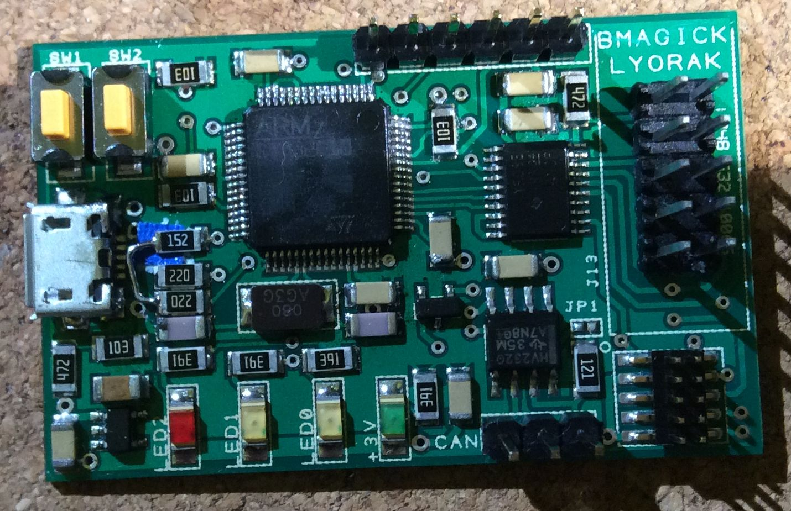
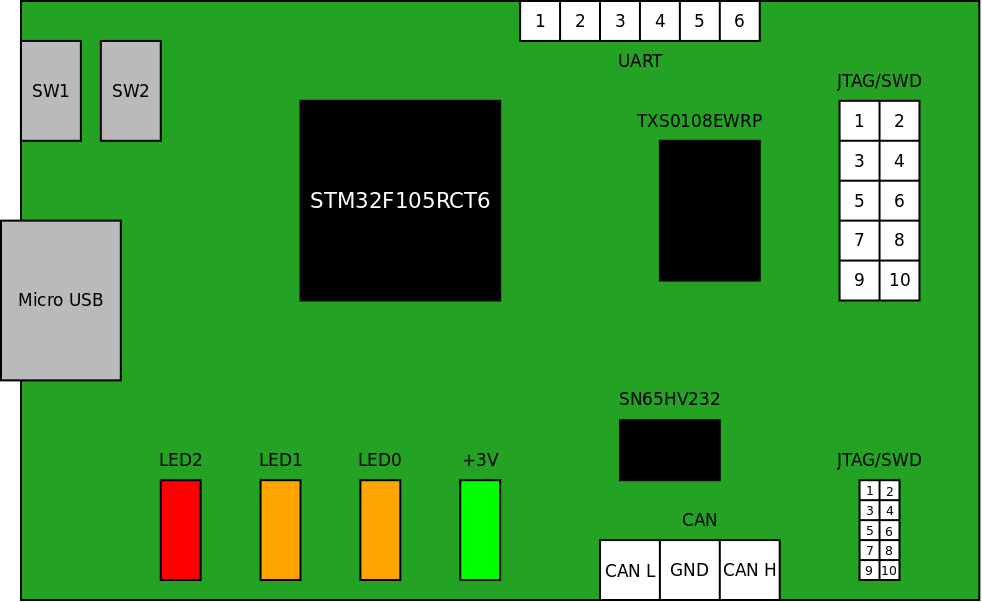
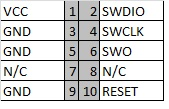

This board is an evolution of the Blackmagic Riachardeoin board. This board has been built
and functions.

## The major differences

Compared to the Ricahrdeoin variant:
* PCB has been re-designed to allow assembly at home. It is a single side mounted PCB with 1206 passive components.
* Added CAN interface
* Added 2.54mm IDC connector
* MicroUSB intead of miniUSB
* Uses STM32F105RCT6 instead of STM32F103

Due to the bigger components the size of the board is larger: 48mm x 30mm.

The board has been designed with the free DesignSpark PCB tool.

## Board description

See the simplified hardware layout of the board below that shows the major components:

## JTAG pinout

The debug connectors are 10 pin (2x5) connectors. Both have the same pinout, only their size differs.

Pin 1 of the JTAG connectors are not marked on v1 of the board. 
See the board overview above to identify the connector pins.

Pinout in JTAG mode:

Pinout in SWD mode:

In the simplest form you shall connect only GND, VCC, SWCLK, SWDIO in order to get a working debug connection.

## UART connector pinout

See the board overview above to identify the connector pins.

1. GND
1. UART TX (SWCLK when debugging the Black Magic board itself)
1. UART RX (SWDIO when debugging the Black Magic board itself)
1. N.C.
1. VCC
1. N.C.

If you want to debug the board itself, you shall power it up in DFU mode. Otherwise the UART function will not allow proper debug connection. 

## CAN connector pinout

1. CAN L
1. GND
1. CAN H

There is a wire jumper JP1 just above the CAN connector. It is closed by default and enables a 120Ohm termination on CAN. 
If you want to use external bus termination then you shall cut the pcb between the JP1 pads.

## Switches

* Press SW1 while connecting the USB cable to force the MCU to UART boot loader mode.
* Press SW2 while connecting the USB cable to activate the USB boot loader

## LEDS

* LED +3V is always ON when the board is powered up.
* LED0 is blinking when there is communication on the AUX UART (/dev/ttyACM1)
* LED1 is indicateing when the debug communication is active
* LED2 is indicating error condition (by blinking error messages with morse code)

## Parts

See the [Parts List](Parts.md)

There were a number of adjustments on the BOM after the board has been manufactured. The included part list is valid and more up to date than the schematic.

## Known bugs

There is one known problem with this versionn of the board. The 1k5 USB pull-up resistor is connected to the "D-" USB pin 
instead of the "D+". Theresult is that the host is enumerating the board as Low-speed. To workaround this the R23 
shall be re-wired to connect to R20 instead of R18. See the picture above for the details on how it is solved.

## Software differences

Due to different CPU variant the following changes were needed:

* stm32_mem.py has been changed to upload 2K blocks instead of 1K because the Flash block size is 2K on STM32105.
* USB driver of STM32105 differs from the STM32F103 variant. SRC/PLATFORMS contains a lyorak subfolder with the necessary changes.

use "make PROBE_HOST=lyorak" to build the boot loader and the gdb application for the lyorak variant.

